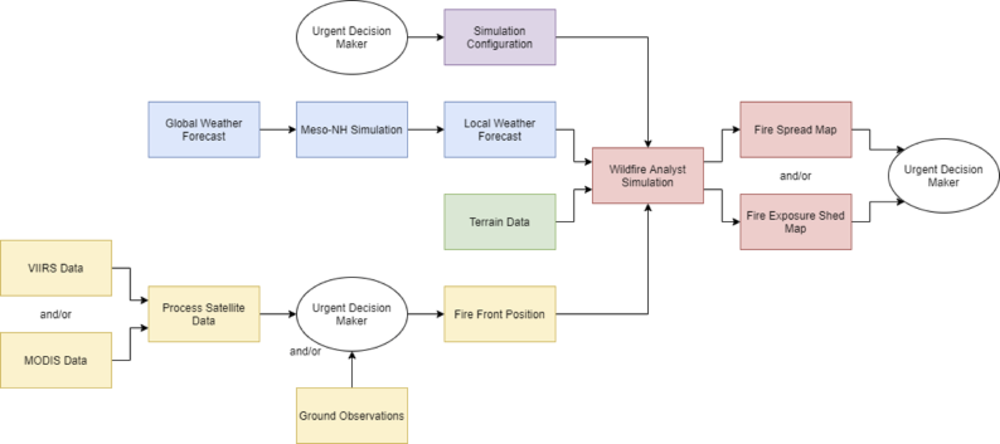
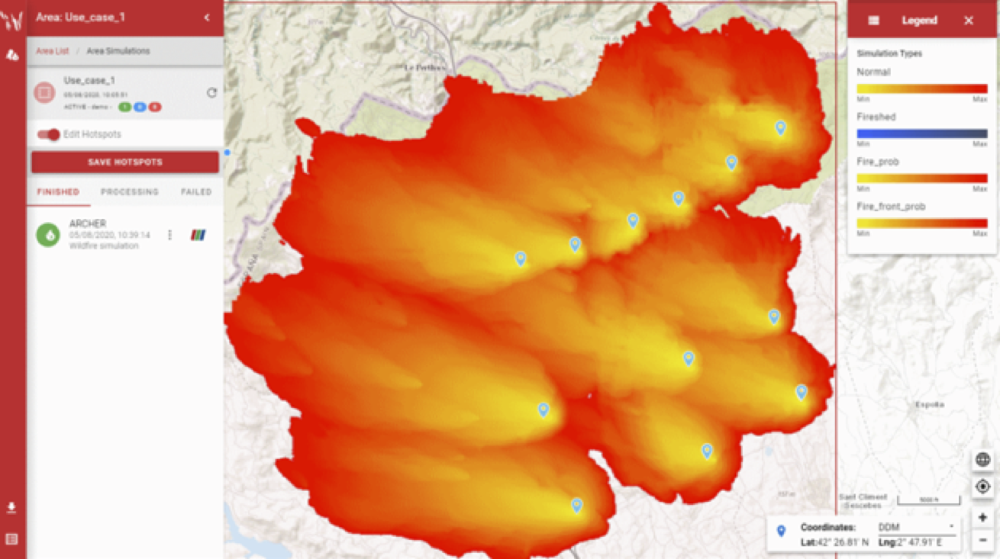
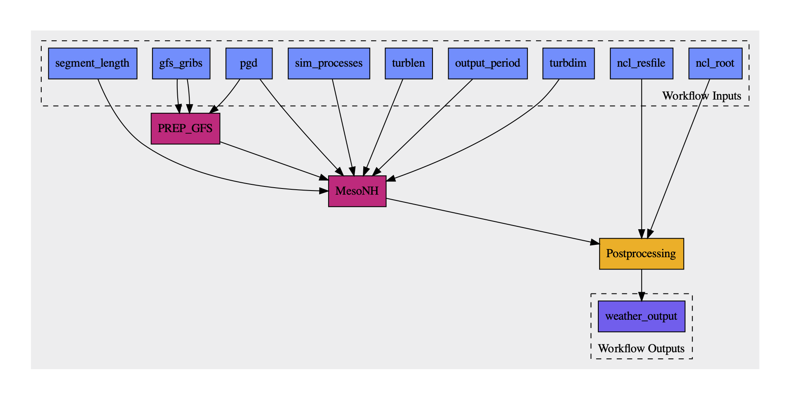

template: titleslide

# Supercomputing with MPI meets the Common Workflow Language standards
# An experience report
## [Rupert W. Nash](https://orcid.org/0000-0002-6388-7353), [Michael R. Crusoe](https://orcid.org/0000-0002-2961-9670), [Max Kontak](https://orcid.org/0000-0003-3738-7483), [Nick Brown](https://orcid.org/0000-0003-2925-7275)

Paper: https://arxiv.org/abs/2010.00422  
Slides: https://common-workflow-lab.github.io/2020-works-workshop-mpi-cwl/

---

# Who?
.center[
<table class="authors">
<tr>
<td>
<a href="https://orcid.org/0000-0002-6388-7353">Rupe Nash</a>
</td>
<td>
<a href="https://orcid.org/0000-0003-2925-7275">Nick Brown</a>
</td>
<td>
<a href="https://orcid.org/0000-0003-3738-7483">Max Kontak</a>
</td>
<td>
<a href="https://orcid.org/0000-0002-2961-9670">Michael R. Crusoe</a>
</td>
</tr>

<tr>
<td>EPCC, University of Edinburgh</td>
<td>EPCC, University of Edinburgh</td>
<td>DLR German Aerospace Center</td>
<td>VU Amsterdam / CommonWL project leader</td>
</tr>

<tr>
<td></td>
<td></td>
<td></td>
<td></td>
</tr>
</table>
]

???

Speaker: Rupe

---
# Talk Overview


???

Speaker: Rupe

Since this is an "experience report" , want to tell a bit of a story

- about how this work came about,
- the 90% solution we found (spoiler alert - it's CWL),
- the work we (VESTEC) did with the CWL community (Michael) to produce
a solution
- that meets our basic needs and had a few unanticipated benefits
- talk about the limitations and solicit thoughts on how to take this
  forwards 

---

# Problem statement

.columns[

.col2[

The VESTEC (Visual Exploration and Sampling Toolkit for Extreme Computing) project seeks to fuse HPC and real-time data for urgent decision making for disaster response.
  
We need to run workflows that include MPI-parallelised applications on HPC.

We didn't want to reinvent all the wheels.

]
.col2[

.center[

]

Example workflow from VESTEC of wild fire monitoring.

*Thanks to Gordon Gibb for the image.*
]
]

???

Speaker: Rupe


Rupe, Nick, Max are working on VESTEC.

VESTEC clearly requires a workflow approach, in part to automate
as much as possible for speed and accuracy.

The simplest case requires
- receiving data
- pre-processing
- parallel simulation(s) on HPC (10--10,000 cores)
- post-processing
- making data available to decision makers


More complex cases launching
further simulations in response to results or new data, allowing
what-if scenario exploration, interactive visualisation of results.

---
# Problem statement

.columns[
.col2[

While we did create a custom workflow management system (see G. Gibb *et al.*, UrgentHPC workshop 2020), we really didn't want to implement *all* of the parts of a WMS.

In particular we believed that tools must exist that could:

- describe step inputs
- actually execute the (MPI-parallel) program
- describe any generated outputs
- represent this in a structured way

And ideally wanted this in a standardised way.

We found that CWL was our closest match.

]
.col2[


Randall Monroe, https://xkcd.com/2140/
]
]

???

Speaker: Rupe

Needed to have control over whether, where, and with what parameters parts of the
workflow run

But didn't want to reinvent all the wheels, nor to hack together a
bunch of bash scripts on each HPC machine used

Spoiler alert: CWL

---
# Talk Overview


???

Speaker: Rupe

So why didn't CWL work with MPI?

---
# Message Passing Interface

The Message Passing Interface (MPI) is an important standard for HPC,
*i.e.* large, tightly-coupled simulations.

Start many copies of the same program, which differ only by a unique
index (their rank).

MPI is a library allowing them to perform:
- point-to-point and collective communication
- synchronisation operations,
- IO
- more

Typically MPI programs have to be started by a special launcher:

```bash
mpiexec -n $NPROCS $APPLICATION $ARGS
```

???

Speaker: Rupe

With apologies to audience members, this is MPI in one slide

Large > 1k working together on the same problem
So not embarassingly parallel: ensembles/parameters sweeps

The MPI standard specifically does not require this or any other way
to start programs, but recommends that this method be available.

---
# Common Workflow Language

CWL defines a standard for describing command line tools and workflows made from those tools.

It aims to model the requirements of those tools explicitly to enable flexibility and portability.

For example, if you want to use Docker, you don't manually specify "docker run my_container foo"; you say which Docker format container is recommended or required. The workflow engine sets up everything else.


???

Speaker: Michael

Do you want to cover why MPI progs don't work in standard CWL? MPI affects scheduling and execution
I.e. the following are implementation/system dependent:
 - the actual name of the `mpiexec` command
 - the flag to set number of processes
 - other flags needed
 - environment variables needed to be set (e.g. SLURM and passing the
   node list)

---
# Hello world in CWL
.columns[
.col2[
``` yaml
cwlVersion: v1.0
class: CommandLineTool


inputs:
  message:
    type: string
    inputBinding:
      position: 1


baseCommand: echo


outputs: []
```
]
.col2[
```
% cwltool hello/serial.cwl --message "Hello, world"
INFO /Users/rnash2/.virtualenvs/cwl/bin/cwltool 3.0.20200807132242
INFO Resolved 'hello/serial.cwl' to 'file:///Users/rnash2/work/vestec/2020-works-workshop-mpi-cwl/hello/serial.cwl'
INFO [job serial.cwl] /private/tmp/docker_tmp86tr7_wy$ echo \
    'Hello, world'
Hello, world
INFO [job serial.cwl] completed success
{}
INFO Final process status is success
```
]
]

???

Speaker: Michael

---
# Talk Overview


???

Speaker: Michael


---
# A first attempt within standard MPI

.columns[
.col2[

Since CWL supports using JavaScript to compute values for some elements
within a tool description, RWN created a few functions to
programmatically insert the necessary MPI job launch commands to the
front of the command line string.

- 🙂 Worked on laptop
- 🙂 Worked on ARCHER (Cray XC30, UK National Supercomputing Service)
- 😐 Requires NodeJS
- 🤢 Ugly tool description
- ☹️ Failed on SLURM-based cluster (requires environment variables to be set)
- ☹️ Failed to work with containers

]

.col2[
``` yaml
cwlVersion: v1.0
class: CommandLineTool
requirements:
  InlineJavascriptRequirement:
    expressionLib:
      - $include: mpi.js
  SchemaDefRequirement:
    types:
      - $import: mpi.yml
inputs:
  message:
    type: string
    inputBinding:
      position: 1
  mpi:
    type: mpi.yml#mpiInfo
    default: {}
arguments:
  - position: 0
    valueFrom: $(mpi.run("echo"))
outputs: []
```
]
]

???

Speaker: Rupe

Kinda worked, but wasn't fit for purpose, so I reached out via Github
to the CWL community

After starting to work with Michael, it became clear that MPI
execution had to be treated differently and integrated with the job
runner, comparable to software container runtimes

---
# Requirements

.columns[
.col2[
Tool descriptions:

  - must opt in to potentially being run via MPI;

  - must allow for this to be disabled;

  - must be able to control number of processes either directly or via
    an input;

  - must remain the same for different execution machines;

  - should be as close to a non-MPI version of the same tool as
    practical.
]
.col2[	
The runner also needs to provide a configuration
mechanism:

  - to specify the platform specific launcher;

  - to specify how to set the number of processes;

  - to add any further flags required;

  - to pass through or set any environment variables required.

]
]

???

Speaker: Michael

---
# Extension to the CWL specification
.columns[
.col2[
CWL supports the concept of a requirement which "[modifies the semantics
or runtime environment of a process](https://www.commonwl.org/v1.1/CommandLineTool.html#Requirements_and_hints)".

The minimum features we need are:
- to enable the requirement, and
- to pass through the number of MPI processes to start.

The number of processes can either be a plain integer or a CWL
`Expression` which evaluates to an integer.

This was added to the CWL reference runner as an extension, requiring the `--enable-ext` flag.

]
.col2[

``` yaml
- name: MPIRequirement
  type: record
  extends: cwl:ProcessRequirement
  inVocab: false
  fields:
    - name: class
      type: string
      jsonldPredicate:
        "_id": "@type"
        "_type": "@vocab"
    - name: processes
      type: [int, string]
```

SALAD Schema for new requirement, [source](https://github.com/common-workflow-language/cwltool/blob/84939620c3eec1ab11369849c63237ebfa48da41/cwltool/extensions.yml#L158).

]
]

???

Speaker: Michael

We treat the case of zero processes requested as being equivalent to
disabling the requirement.

Note the we're talking here about the tool description. An expression
can use, say, an input to produce an integer

---
# Hello world in parallel

.columns[
.col2[
``` yaml
cwlVersion: v1.0
class: CommandLineTool


inputs:
  message:
    type: string
    inputBinding:
      position: 1


baseCommand: echo


outputs: []
```
]

.col2[
``` yaml
cwlVersion: v1.0
class: CommandLineTool
$namespaces:
  cwltool: http://commonwl.org/cwltool#

requirements:
  cwltool:MPIRequirement:
    processes: $(inputs.nproc)

inputs:
  message:
    type: string
    inputBinding:
      position: 1
  nproc:
    type: int

baseCommand: echo


outputs: []
```
]
]

???

Speaker: Michael & Rupe

Left: the hello world shown before and on the right is a comparable
one that accepts the number of processes to start as an input

Michael: CWL side thoughts: namespace

Rupe: fairly simple from a user's POV, just need to figure out how to
choose the number of processes (which you'd have to do anyway)

---
# Platform configuration

We added a command line option (`--mpi-config-file`) to cwltool to accept a simple YAML file containing
the platform configuration data.

| Key              | Type               | Default    | Description                                                                                                                                                |
| :--------------- | :----------------- | :--------- | :--------------------------------------------------------------------------------------------------------------------------------------------------------- |
| `runner`         | `str`              | `"mpirun"` | The primary command to use.                                                                                                                                |
| `nproc_flag`     | `str`              | `"-n"`     | Flag to set number of processes to start.                                                                                                                  |
| `default_nproc`  | `int`              | `1`        | Default number of processes.                                                                                                                               |
| `extra_flags`    | `List[str]`        | `[]`       | A list of any other flags to be added to the runner’s command line before the `baseCommand`.                                                               |
| `env_pass`       | `List[str]`        | `[]`       | A list of environment variables that should be passed from the host environment through to the tool (*e.g.* giving the nodelist as set by your scheduler). |
| `env_pass_regex` | `List[str]`        | `[]`       | A list of Python regular expressions that will be matched against the host’s environment. Those that match will be passed through.                         |
| `env_set`        | `Mapping[str,str]` | `{}`       | A dictionary whose keys are the environment variables set and the values being the values.                                                                 |

???

Speaker: Rupe

We also had to have a way to adapt to the various HPC systems we used
and settled on this

Within the runner, this argument, if present, is used to configure the
MPI runtime (although there defaults in the code).

When a tool is actually executed, the runner checks for the
`MPIRequirement`, evaluates the processes attribute and, if present and
non-zero, it uses the configuration data, to construct the appropriate
command line which is prepended to the tool's command line.

I'll show an example in a few slides.

---
# Talk Overview


???

Given we're talking about this, it's not surprising it worked, but we
in VESTEC had a few unanticipated bonuses

---
# We showed that it works

.columns[
.col2[
A modest number of unit tests.

Used within VESTEC WMS to wrap individual tasks.
]
.col2[

]

Wildfire simulation results.
]

???

Speaker: Rupe

14 tests

And also small sub-workflows

---
# Use with workflows

.columns[
.col2[
CWL supports composing a set of steps into a workflow.

Useful for VESTEC for cases when there are steps that will always occur together  
*e.g.* pre-processing > simulation > post-processing.

Composing tool executions with different MPI requirements worked
transparently.

Uses the same platform configuration for all MPI steps.

]
.col2[


Example sub workflow from wildfire use case: localised weather
simulation.

Blue: input(s)  
Magenta: MPI step  
Yellow: non-MPI step  
Purple: output(s)  
]
]

???

Speaker: Rupe

This workflow
- uses one or more global weather forecasts from the US NOAA Global
  Forecast System (`gfs_gribs` input) (potentially real time, published
  every 6hrs).

- `PREP_GFS` step interpolates the meterological fields onto the
  domain for the simulation (specified by the input `pdg`, *i.e.* the
  physiographic data) - this step has to be run on a compute node on
  ARCHER so has to be `aprun`ed as a single process MPI job.
  
- runs the Meso-NH mesoscale atmospheric simulation application in
  parallel (as specified by the `sim_processes` input) using the GFS
  data provided as initial and boundary conditions, for an experiment
  of simulated duration `segment_length`

- The outputs of this are then post-processed by a script into a single netCDF
  file with the fields of interest for use later in the outer workflow.


---
# Performance monitoring

.columns[
.col2[
Generally accepted as important in HPC.

Some centres monitor user jobs by default or sampling.

Various tools, including LIKWID
<https://hpc.fau.de/research/tools/likwid/>.

Can use the MPI configuration file to construct an appropriate command
line.
]
.col2[
``` yaml
runner: srun
extra_flags: [
  "likwid-perfctr", 
  "-C", "L:N:0", 
  "-g", "FLOPS_DP", 
  "-o", "/output/path/likwid_%j_%h_%r.json"
  ]
nproc_flag: -n
env_pass_regex: ["SLURM_.*"]
```

Platform configuration file for using LIKWID on a SLURM-based cluster at DLR.

]
]

???

Speaker: Rupe

Monitoring the performance of parallel applications is particularly
important when they may be running across thousands of cores and is very
common in the HPC and supercomputing community.

When a workflow may execute very many parallel jobs this is even more so.

Some centres do this to proactively monitor for errors/failing
components. Others just to track usage in more detail.

LIKWID from Friedrich-Alexander-Universität (FAU)

---
# Performance monitoring

We validated this using the high-performance conjugate
gradient benchmark (http://www.hpcg-benchmark.org).

Ran on DLR cluster (4 x 14 core Intel Xeon Gold 6132 per node).

.centre[
<table style="width: 90%; border-collapse: collapse;">
<thead style="border-bottom: solid thin black">
<tr>
  <th></th>
  <th></th>
  <th colspan="5">LIWKID reported</th>
</tr>
<tr>
  <th></th>
  <th>HPCG reported</th>
  <th colspan="3">Perf / GFLOP/s</th>
  <th colspan="2">µ-op rate / GHz</th>
</tr>
<tr>
  <th>Cores</th>
  <th>Perf / GFLOP/s</th>
  <th>Total</th>
  <th>Mean</th>
  <th>S.D.</th>
  <th>Total scalar</th>
  <th>Total vector</th>
</tr>
</thead>
<tbody style="text-align: right">
<tr>
  <td>56</td>
  <td>38.0</td>
  <td>39.7</td>
  <td>0.71</td>
  <td>0.002</td>
  <td>39.0</td>
  <td>0.31</td>
</tr>
<tr>
  <td>112</td>
  <td>71.7</td>
  <td>74.6</td>
  <td>0.67</td>
  <td>0.002</td>
  <td>73.5</td>
  <td>0.58</td>
</tr>
</tbody>
</table>
]
???

Speaker: Rupe

Why HPCG? the application reports its own
estimates of the floating point performance achieved, allowing us to
have some confidence that the reported numbers are correct.

Can see the numbers are similar. HPCG gives an estimate based on a
lower bound on the number of operations required to perform the
calculations.

LIKWID measures what was executed with the hardware counters so no
surprise it's a little higher

Can also see some other metrics that might be of interest, e.g. the
ratio of scalar and packed micro-operations, which indicate that the
compiler was not able to generate SIMD instructions from the HPCG code
efficiently.

We can vary the metrics collected by simply changing the platform
configuration file!

---
# Containers

Also tested successfully (once) with the Singularity software container engine using a Docker format software container. 

???
Speaker: Michael

Mention the "classic CWL approach, as the standards have long
supported both software containers and references to the name (and
published identifier, if available) of the software tool".


---

# Software requirements


Another challenge to supporting the execution of portable workflows on
supercomputers is the requirement for custom-compiled software and the
lack of software containers for performance reasons.

This is somewhat orthogonal to the classic CWL approach, as the standards
have long supported both software containers and references to the name
(and published identifier, if available) of the software tool.

``` yaml
hints:
  SoftwareRequirement:
    packages:
      Meso-NH:
        version: ["5.4.2"]
```

The CWL reference runner [has a feature which maps these software
identifiers to locally available software
packages](https://github.com/common-workflow-language/cwltool/#leveraging-softwarerequirements-beta),
and loads them in a site-specific way using a local configuration.

We [have adopted](https://github.com/VESTEC-EU/app-cwl/blob/main/test/archer/mesonh-modules.yml)
this same approach within the VESTEC system, which ensures that our
workflows are portable between target HPC systems.

```
# The CWL reference runner and toil-cwl-runner can transform the above
# `SoftwareRequirement` into a site specific command like:
module load mesonh/5.4.2-LXifort-O2
```

???

Speaker: Rupe

Wired cwltool + SoftwareRequirements to `module load MesoNH` etc

---
# Talk Overview


???
Speaker: Rupe

I'll mention some issues we know about, sum up, and ask for your
thoughts.

---
# Limitations

We have given the Common Workflow *Language* only a very simple model
of an MPI program: the number of processes to start.

Users of HPC codes often need to consider:

- hybrid parallelism, e.g. OpenMP;

- node memory architecture + process placement;

- use of hyperthreads

- MPI implementation-dependent things (*e.g.* progress engine threads)

For now, we can set these via the reference runner's platform
configuration file, but that applies across **all** tools run by
invocation.

We have "deferred this to future work", although our feeling is that
this could be tackled with the overrides feature of the reference
runner.

Other suggestions would be appreciated!

???

Speaker: Rupe

The number of processes is probably the most important parameter but
everyone who's been doing HPC for a while knows there's a lot more

- E.g. with MPI+OpenMP codes you have to map that parallelism onto the
  executation hardware: e.g. 2 x 16 core CPUs in a node might have 2
  NUMA domains per CPU so do you want to run 1 MPI process per NUMA
  domain and set OMP_NUM_THREADS to the number of cores per NUMA
  domain? How do you tell your `mpirun` program this?

---
# Future Work

Specify version of the MPI standard required.

Specify level of thread support required by application.

More complete testing with software containers.

Extend [CWLProv](https://w3id.org/cwl/prov/) to capture more run time information, like `module load` invocations

???

Speaker: Rupe

A few smaller things we will definitely look at:

Working towards MPI version 4.0 at present

Thread support can be one of 4 levels (SINGLE, FUNNELED, SERIALIZED,
MULTIPLE)

---
# Conclusions

We have created a minimal extension to the CWL specification that
allows a tool to specify that it requires an MPI job launcher and way
to set the number of MPI processes to start

We have implemented this, and a mechanism for platform configuration,
within the CWL reference runner

VESTEC authors happy
- to find CWL was powerful and flexible enough to be altered to support MPI
- CWL developers were open to helping make these alterations and accepting them
- software requirements feature of CWL could help make our tool descriptions more portable
- multi-step CWL workflows could simplify our larger workflow system

MRC as a member of the CWL/bioinformatic community was happy
- find a new user community
- be confirmed in the value of open standards

Goal: progress `MPIRequirement` or equivalent to CWL standard


???

Speaker: Rupe & Michael

num of MPI procs can be hard coded, supplied as an input directly, or
calculated in any way allowed by a JavaScript expression

---
# Acknowledgements
 
Thanks!

Much of this work was funded under the EU FET VESTEC H2020 project, grant
agreement number 800904 (https://vestec-project.eu)

This work used the ARCHER UK National Supercomputing Service
(<http://www.archer.ac.uk>).

https://www.commonwl.org/

https://github.com/common-workflow-language/cwltool/#running-mpi-based-tools-that-need-to-be-launched
